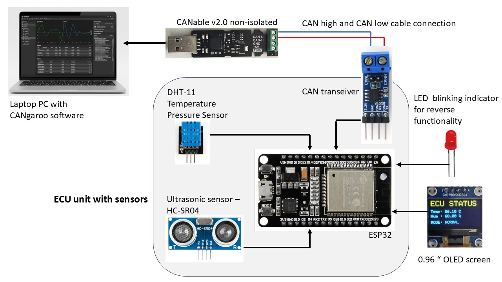

# CAN-Based Embedded ECU Prototype

Demo Video : https://drive.google.com/file/d/1GaiQH3QInpbhzhxm0P819niqdjihEMWJ/view?usp=sharing

## 📌 Project Overview

This project implements a CAN-based embedded ECU prototype using an ESP32 to simulate a reverse assist system, inspired by automotive HIL (Hardware-in-the-Loop) testing principles.

The ECU communicates over CAN with a PC-based test node (Laptop + CANable v2.0), receives control commands, processes sensor data, and publishes system status frames. The project focuses on functional CAN communication, ECU state control, and validation, rather than diagnostics.





## 🎯 Project Objectives

- Design a CAN-enabled ECU using ESP32 and an external CAN transceiver
- Simulate reverse assist logic controlled via CAN commands
- Separate always-active environmental sensing from mode-dependent sensors
- Implement non-blocking, time-based sensor acquisition
- Validate ECU behavior using PC-based CAN tools (SavvyCAN / Cangaroo)
- Apply HIL-style testing concepts at signal level

## 🧠 System Concept

- **ESP32** acts as the ECU
- **Laptop + CANable v2.0** acts as the test controller / second ECU
- Reverse mode is activated/deactivated via CAN
- Environmental data (temperature & humidity) is always available
- Distance-based warning logic is active only in reverse mode
- Visual feedback is provided using:
  - OLED display (HMI)
  - Status LED (warning indication)

## 🧩 Hardware Components Used

- ESP32 Dev Module
- SN65HVD230 CAN Transceiver Module
- CANable v2.0 USB-to-CAN Adapter
- DHT11 Temperature & Humidity Sensor
- 0.96" OLED Display (I²C, 128×64)
- LED + 220Ω resistor (Reverse indicator)
- Laptop (for CAN testing & monitoring)

## 🔌 Connection Details

### ESP32 ↔ CAN Transceiver (SN65HVD230)

| Transceiver Pin | ESP32 Pin |
|----------------|-----------|
| 3.3V           | 3V3       |
| GND            | GND       |
| TXD            | GPIO 5    |
| RXD            | GPIO 4    |

> **Note:** CAN transceiver operates at 3.3V (no 5V used)

### CAN Transceiver ↔ CANable v2.0

| CAN Transceiver | CANable |
|----------------|---------|
| CANH           | CANH    |
| CANL           | CANL    |

- CANH and CANL are twisted together
- 120Ω termination enabled on one side (CANable)

### ESP32 ↔ DHT11 Sensor

| DHT11 | ESP32   |
|-------|---------|
| VCC   | 3V3     |
| DATA  | GPIO 27 |
| GND   | GND     |

### ESP32 ↔ OLED Display (I²C)

| OLED | ESP32   |
|------|---------|
| VCC  | 3V3     |
| GND  | GND     |
| SDA  | GPIO 21 |
| SCL  | GPIO 22 |

### ESP32 ↔ Reverse Indicator LED

| LED          | ESP32                        |
|--------------|------------------------------|
| Anode (+)    | GPIO 25 (via 220Ω resistor) |
| Cathode (−)  | GND                          |

## 📡 CAN Communication Design

### CAN Receive (Control Commands)

| CAN ID | Byte   | Description    |
|--------|--------|----------------|
| 0x200  | Byte 0 | Command ID     |
|        | Byte 1 | Command Value  |

**Command Table:**

| Command | Meaning              |
|---------|----------------------|
| 01 01   | Enable reverse mode  |
| 01 00   | Disable reverse mode |
| 02 01   | Inject fault         |
| 02 00   | Clear fault          |

### CAN Transmit (ECU Status)

| CAN ID | Byte | Signal         |
|--------|------|----------------|
| 0x100  | 0    | Demo speed     |
|        | 1    | Temperature    |
|        | 2    | Humidity       |
|        | 3    | Fault flags    |
|        | 4    | Reverse active |
|        | 5    | Forced fault   |

## 🖥 OLED Display Behavior

### Normal Mode
- ECU status
- Live temperature & humidity
- Reverse mode inactive

### Reverse Mode
- Distance to obstacle
- Warning level (SAFE / CAUTION / DANGER)
- Temperature & humidity displayed as secondary info
- LED blinks faster as distance decreases

## 🚀 Getting Started

### Prerequisites
- PlatformIO installed in VS Code
- CANable v2.0 configured and connected
- CAN analysis tool (SavvyCAN / Cangaroo)

### Building and Uploading
```bash
# Build the project
pio run

# Upload to ESP32
pio run --target upload

# Monitor serial output
pio device monitor
```

## 📝 Testing

1. Connect the CANable v2.0 to your PC
2. Open your CAN monitoring tool
3. Send control commands to `0x200`
4. Monitor ECU status on `0x100`
5. Observe OLED display and LED behavior

## 🔧 Configuration

CAN bus speed and GPIO pins can be configured in [src/main.cpp](src/main.cpp).

---

**Author:** Saikiran
**Date:** January 2026  
**License:** MIT
